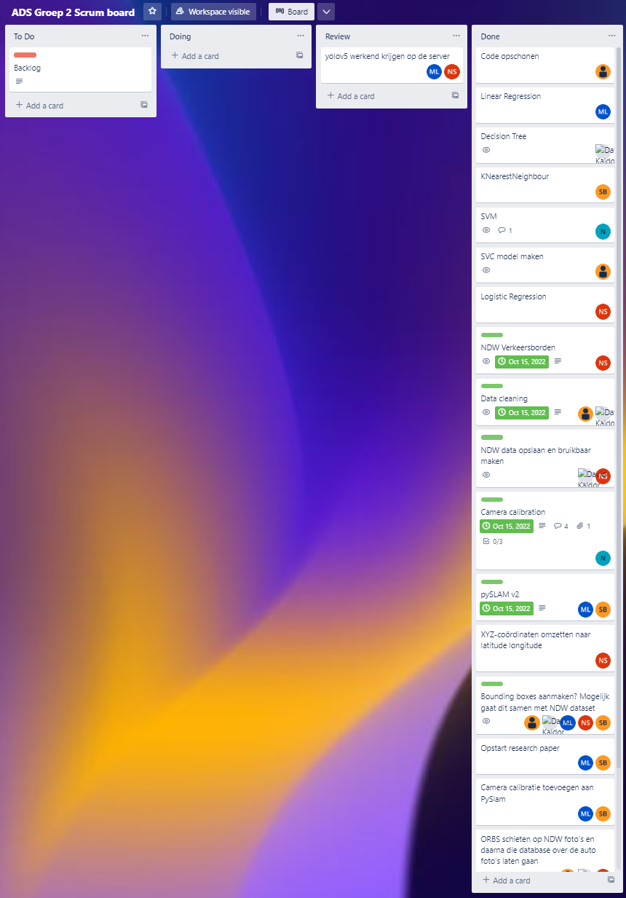
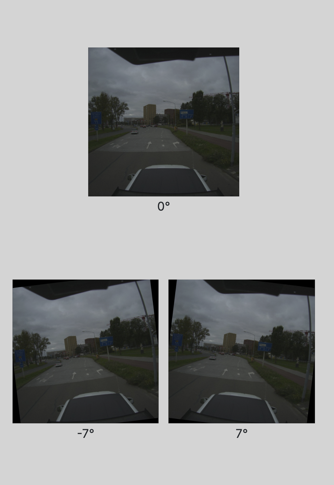
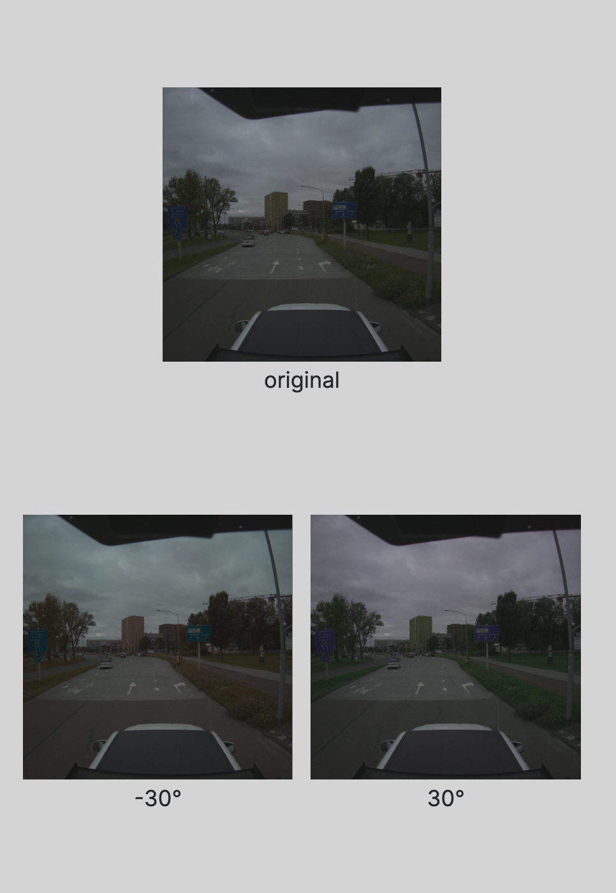
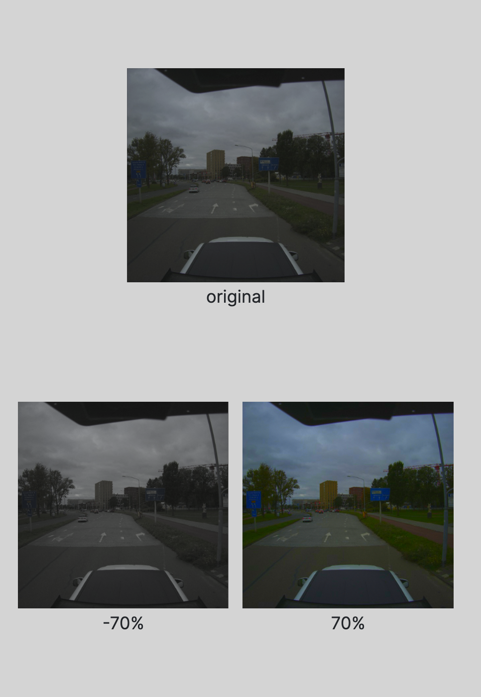
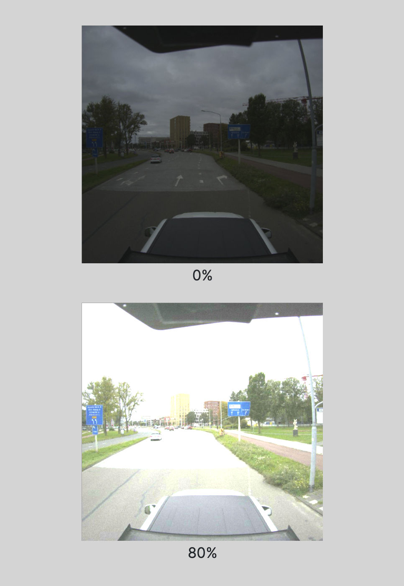
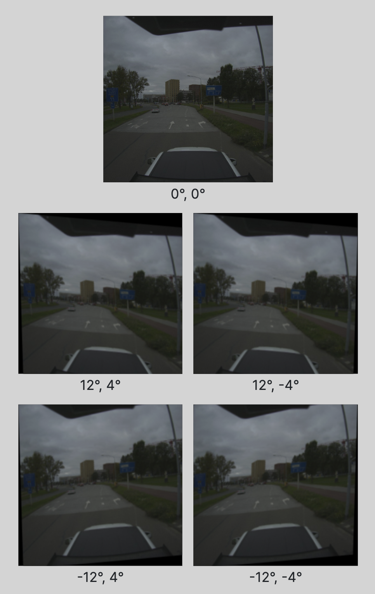

# David's Portfolio - Group 2 of ADS
### Student: David Kaldor - 20141211
#### Closely collaberated with Bram


# <a id="table-of-contents"></a>Table of Contents <!-- omit in toc -->
- [Obligatory Criteria](#obligatory-criteria)
  - [Datacamp assignments](#datacamp-assignments)
- [1. The Project](#the-project)
  - [Foodboost](#the-project-foodboost)
  - [Vision](#the-project-vision)
- [2. Predictive Models](#predictive-models)
  - [Foodboost (Decision Tree Classifier)](#predictive-models-foodboost)
  - [Vision (YOLOv5)](#predictive-models-vision)
- [3. Domain Knowledge](#domain-knowledge)
  - [Foodboost](#domain-foodboost) 
  - [Vision](#domain-vision) 
- [4. Data Preprocessing](#data-preprocessing)
  - [Foodboost](#data-preprocessing-foodboost)
  - [Vision](#data-preprocessing-vision)
- [5. Communication](#communication)
  - [Presentations](#presentations)
  - [Paper](#paper)
- [6. Codesnippets](#codesnippets)
---

# <a id="obligatory-criteria"></a>Obligatory Criteria
## <a id="datacamp-assignments"></a>Datacamp assignments

- 21 / 01 / 2023 Datacamp progress

  <details><summary>Datacamp progress</summary></details>
  
  [Back to Table of Contents](#table-of-contents)

# <a id="the-project"></a>1. The Project
There were two projects we worked on. The first project is Foodboost, and the second project is Vision (IV-Infra). I will cover both of them seperately here.

##  <a id="the-project-foodboost"></a>Foodboost
The overarching objective of the Foodboost project was to develop a recipe prediction model. We elected to utilize the Nutri score, a system devised in France that is gradually being adopted in the Netherlands to raise awareness of food nutrition. Our aim was to predict recipes that gradually incorporate healthier ingredients, allowing users of our model to gradually adjust to healthier eating habits without drastic changes. We believe that this approach makes it more feasible for individuals to maintain a healthier lifestyle in the long term.

For this goal, we set the following research questions:
1. How can we predict a healthier diet for someone based on their previous recipes?
2. How can we define "healthier"?
3. What is the effectiveness of the Nutri-Score system in guiding users towards healthier food choices within the Foodboost recommendation system?

### Future Work
The main setback I felt we had was the lack of real user data, more specifically, user input data. User input data is considered data we can use where a user has rated a considerable amount of tried recipes. Lacking user data is important for a machine learning model that aims to recommend healthier food options because the model relies on this data to learn about the user's preferences, dietary restrictions, and current eating habits. Without this information, the model would not be able to make personalized or accurate recommendations. Additionally, the model would not be able to track the user's progress and adjust its recommendations accordingly. Without data, the model would not be able to learn from user interactions and feedback, which is crucial for improving the model's performance over time.

### Conclusions

#### 1. How can we predict a healthier diet for someone based on their previous recipes?

One way to predict a healthier diet for someone based on their previous recipes is to analyze the nutrient content of the recipes and make recommendations for substitutions or additions of healthier ingredients. For example, if a person frequently uses high-calorie, high-fat ingredients, suggestions could be made to use leaner protein sources and more vegetables. Additionally, a dietary analysis could be done to identify any nutrient deficiencies and make recommendations to address those deficiencies through food choices. Machine learning algorithms can also be used to analyze the person's previous recipes and suggest new, healthier recipes based on their dietary patterns.

#### 2. How can we define "healthier"?

The Nutri-Score is a nutrition label that can be used to define "healthier" food options. The Nutri-Score uses a five-color scale (from dark green to red) to classify foods based on their nutritional quality. The score takes into account the amount of energy (calories), sugar, saturated fat, sodium, and the presence of fruits, vegetables, nuts, fiber, and protein. Foods with a higher Nutri-Score are considered healthier than those with a lower score. Food items are scored based on these criteria and assigned a letter grade (A, B, C, D, or E) with A being the healthiest and E being the least healthy. This scoring system is a simple and effective way to help consumers make informed choices about the nutritional quality of the food they buy.

#### 3. What is the effectiveness of the Nutri-Score system in guiding users towards healthier food choices within the Foodboost recommendation system?

To determine the effectiveness of the Nutri-Score system in guiding users towards healthier food choices within the Foodboost recommendation system, a study should be conducted where participants are asked to use the Foodboost recommendation system for a certain period of time, for example, 6 months. The study should also include a control group which does not use the Foodboost recommendation system.

The study should measure the proportion of food choices made by the participants that have a higher Nutri-Score rating. Additionally, the study should measure the nutrient content of the food choices made by the participants, and compare the nutrient content of the food choices made by the participants in the experimental group to those made by the control group.

It's also important to have a measure of participant's satisfaction with the system, and their perception of the Nutri-Score system in terms of its usefulness and ease of use.

The results of such a study would provide an indication of the effectiveness of the Nutri-Score system in guiding users towards healthier food choices within the Foodboost recommendation system.

### Planning
Initially, we had intended to utilize Trello as a means of keeping each other informed about progress made on the project. However, as we progressed, we found ourselves neglecting Trello in favor of prioritizing the completion of tasks.

## <a id="the-project-vision"></a>Vision
In this research project, the context was to develop a data science solution for checking the status of traffic signs for IV-Infra. The problem being addressed was the need to efficiently and accurately map and check the status of traffic signs, such as determining if a sign is in the correct location, if it is rotated too much, or if it is expired. 

For this goal, we set the following research questions:
1. "How can traffic signs be recognized and mapped using a series of photos?" 
2. To what extent has research been done into recognizing traffic signs by means of Machine Learning and/or Neural Networks?
3. What drives traffic sign mapping?
4. Which data from the NDW will be integrated into the Neural Network?
5. How accurately can a traffic sign be recognized using LiDAR data?

### Future Work

Based on the research conducted, there are several steps that can be taken to improve the model. One of the most beneficial steps is to increase the amount of data used to train the model. This can be achieved by having IV-infra collect data from various locations and in different weather conditions.

In the future, the model can also be useful for municipalities in maintaining traffic signs. If the model does not detect a sign that is supposed to be present according to NDW, the municipality can check if the sign is damaged or stolen. Conversely, if the model detects a sign that is not in the NDW dataset, it is likely a temporary sign and the municipality can determine the duration of its placement and if it needs to be removed.

Additionally, the model can be utilized to trigger actions based on the recognition of specific traffic signs. For example, the model can be used to prompt self-driving cars to reduce speed at speed signs, speed cameras, and dangerous intersections. This way the model can contribute to the safety of self-driving cars.

### Conclusions

#### 1. "How can traffic signs be recognized and mapped using a series of photos?" 

To address this question, we used YOLOv5 as the object detection model and trigonometric calculations to map the detected traffic signs. We also used a dataset provided by IV-Infra and compared the results to the traffic sign records held by NDW. Overall, the context and research question were clearly defined and were reasonable given the need for an efficient and accurate solution for monitoring traffic signs.

#### 2. To what extent has research been done into recognizing traffic signs by means of Machine Learning and/or Neural Networks?

There has been a significant amount of research done in the field of recognizing traffic signs using Machine Learning and Neural Networks. The task of traffic sign recognition (TSR) is a well-established computer vision task that has been studied extensively in the literature.

Many studies have been conducted using various Machine Learning and Neural Network algorithms such as Support Vector Machines (SVMs), Random Forest, k-Nearest Neighbors (k-NN), Convolutional Neural Networks (CNNs), and Recurrent Neural Networks (RNNs) to name a few.

Convolutional Neural Networks (CNNs) have been particularly effective in TSR, especially deep CNNs. These methods have shown to achieve high accuracy rates on various benchmark datasets such as the German Traffic Sign Recognition Benchmark (GTSRB).

Additionally, researchers have been also working on improving the robustness of TSR systems by incorporating techniques such as data augmentation, transfer learning, and Adversarial machine learning to handle different variations in traffic sign appearances, such as different lighting conditions, weather, and camera perspectives.

In recent years, researchers have also been working on developing real-time TSR systems that can be deployed on vehicles and embedded systems, to enhance the safety of autonomous vehicles.

Overall, the field of TSR using Machine Learning and Neural Networks is a very active area of research with a great deal of progress being made in recent years, and it is expected to continue to evolve as technology improves.

#### 3. How is traffic sign mapping accomplished?

The research question can be approached by using a combination of image processing techniques, machine learning, and data visualization tools.

One way to accomplish traffic sign mapping is to first use image processing techniques such as YOLOv5 to detect and identify traffic signs in images captured by cameras mounted on a vehicle. The output of YOLOv5 detection will give type of detected traffic signs in the images.

Then, trigononmetric calculations are performed on a pair of YOLOv5 output images to retrieve new coordinates signifying the detected traffic sign's location.

Next, these coordinates can be verified against the National Data Warehouse (NDW) database, which contains information on traffic signs in the Netherlands, including their location and attributes. By cross-referencing the coordinates with the NDW database, it can be verified that the traffic signs have been placed in the correct location and that they conform to national and international standards.

Once the coordinates have been verified, they can be plotted on a map using a Python library such as Plotly Express. This allows for the visualization of the locations of the traffic signs and can be used to identify patterns and trends in the data.

In this way, traffic sign mapping is accomplished by using image processing techniques to detect and identify traffic signs, and then using machine learning and data visualization tools to verify the location of the traffic signs and map them on a map.

#### 4. Which data from the NDW will be integrated into the Neural Network?


#### 5. How accurately can a traffic sign be recognized using LiDAR data?

In this research, the use of computer vision techniques and the YOLOv5 object detection algorithm was chosen as the primary approach for detecting and mapping traffic signs in a series of photos. YOLOv5, known for its high accuracy and real-time performance, was trained on the dataset provided by IV-Infra and was able to detect traffic signs with high accuracy. This approach was found to be highly effective in detecting and mapping traffic signs in a variety of environments. In contrast, LiDAR technology, while widely used in tasks such as object detection, mapping, and navigation, proved to be less suitable for this specific task. LiDAR technology is relatively slow, unreliable and requires a clear line of sight to the object, which makes it hard to detect objects that are obscured or behind other objects. Furthermore, while LiDAR is mainly used to detect objects in 3D space, the detection of traffic signs is mainly a 2D task, which can be achieved with high accuracy using computer vision techniques and YOLOv5 object detection algorithm. This approach, therefore, proved to be more efficient and reliable for this study.

### Planning
In this project, we initially planned to use Trello as our task management tool but ended up not utilizing it. Despite this, we were still able to effectively communicate and keep track of our tasks and progress.

<details><summary>Planning Vision</summary></details>

[Back to Table of Contents](#table-of-contents)
# <a id="predictive-models"></a>2. Predictive Models

I have created multiple predictive models, which I will present and discuss separately for each project.
## <a id="predictive-models-foodboost"></a>Project Foodboost

Project foodboost was mainly based around basic machine learning models.

During the Foodboost project, we familiarized ourselves with various models used in data science. These models are trained on basic data and require a set of variables and an objective function to make predictions on new data. There are different models available in the data science world which can be divided into two categories: continuous and discrete models. Continuous models provide a predicted numerical outcome, while discrete models, also known as categorical models, give a specific category as the result. For example, predicting the healthiness of a dish would utilize a discrete model. Some well-known continuous models include Linear Regression, Polynomial Regression, Ridge, and Lasso. Some examples of discrete models include Logistic Regression, Decision Tree, Support Vector Machines, Random Forest Classifier, and K-Nearest Neighbor.

We experimented with these models to understand the type of inputs they expect and the outputs they provide. We also became familiar with various metrics to evaluate the performance of the models, such as accuracy, precision, and recall.

Initially, we tried to make predictions on the Albert Heijn dataset. Our goal was to determine the nutri-score and nutri-label of recipes based on their nutritional values. We used Linear Regression for the nutri-score and Logistic Regression for the nutri-label. After gaining some knowledge on how these models can be used, we moved on to the Food.com database from Kaggle.

We adopted a different approach with the Food.com dataset by converting it into a binary table, where a column was created for every existing label and ingredient. A "1" was entered for each recipe if it contained the label or ingredient, and a "0" if it did not. This resulted in a very large dataset of ones and zeroes. We also mathematically determined the nutri-score and nutri-label. Our aim was to predict whether a user would also like a certain recipe. The Food.com dataset includes recipes from multiple authors with ratings, and our plan was for the model to check for each user which recipes they might still like and then suggest healthier options that are also tasty (recipes with a rating of 4 or 5 on a scale of 1-5).

Initially, we made a model for an author by splitting their data into a training and test set and using a Random Forest Classifier with hyperparameter tuning using Optuna to find the best n_estimators, max_depth and min_samples_leaf. We used the accuracy score as a metric and achieved an accuracy of 0.948. However, upon further experimentation, we discovered that the model was predicting that the author liked every recipe, even ones that they had previously disliked. We suspect that this was due to the large size of the binary table and the high number of variables, which led to the model not being able to handle the large number of zeros. In retrospect, we realized that we had not scaled the data, which may have contributed to a better model performance.

## <a id="predictive-models-vision"></a>Project Vision

Project vision ...

content here

[Back to Table of Contents](#table-of-contents)
# <a id="domain-knowledge"></a>3. Domain Knowledge
# <a id="domain-foodboost"></a>Foodboost
The field of healthy food and nutrition is a complex and ever-evolving one, making it essential for the success of Project Foodboost to have a deep understanding of how healthy diets are constructed. As someone who has been following a healthy diet for the past 9 years, both for personal fitness goals and due to dietary needs stemming from personal health issues, I was well-suited to take on this project.

The goal of Project Foodboost was to develop a recommendation system that helps users adopt healthier eating habits. Given that the concept of "healthy" can be subjective, our approach was to gradually introduce more nutritious options over an extended period of time. By recognizing that eating well is a long-term lifestyle change, and not a temporary trend, we were able to develop a system that takes into account the unique needs and preferences of each individual user.

Through this project, I was able to apply my knowledge and experience in healthy eating to try and create a tool that can assist others in making positive changes to their diets. I am excited to see the impact that this project will have in the future on helping individuals improve their health and well-being through healthier food choices.

## <a id="#domain-knowledge-literature-foodboost"></a>Literature
During this project, which spanned over the first six weeks of the minor kick-off, my main source of knowledge originates from the DataCamp courses. Furthermore I educated myself on the types of recommender systems and how to apply those techniques for promoting a long-term lifestyle change, in addition to understanding the Nutri-Score and Nutri-Label algorithm.

* [Update of the Nutri-Score Algorithm](https://open.overheid.nl/repository/ronl-34c6383f5747298a4d0a93c2ac884f150557f51e/1/pdf/2022-main-algorithm-report-update.pdf)
* [Introduction to Recommender System](https://towardsdatascience.com/intro-to-recommender-system-collaborative-filtering-64a238194a26)
* [A Complete Guide To Recommender Systems](https://towardsdatascience.com/a-complete-guide-to-recommender-system-tutorial-with-sklearn-surprise-keras-recommender-5e52e8ceace1)

## <a id="#domain-knowledge-terminology-foodboost"></a>Terminology

Below are some terms and jargon that are explained in further detail

<details><summary>Nutri-Score</summary>
  
  The Nutri-Score is a nutrition label that uses a five-color scale (from dark green to red) to classify foods based on their nutritional quality. "A" being the best, and "E" being the worst. It takes into account the amount of energy (calories), sugar, saturated fat, sodium, and the presence of fruits, vegetables, nuts, fiber, and protein. Foods with a higher Nutri-Score are considered healthier than those with a lower score. The Nutri-Score label is an easy way for consumers to identify healthier food options at a glance.</details>
  
<details><summary>Nutri-Label</summary>
  
  Nutri-label is a similar concept, it is a nutrition label that is used to display the nutritional value of a product. Nutri-label usually contains information such as the energy value, the amounts of fat, saturated fat, carbohydrates, sugars, protein and salt per serving. It also includes a reference intake (RI) for an average adult. Nutri-label aims to make it easier for consumers to make informed choices about the food they buy and to help them to achieve a balanced diet.</details>
  
<details><summary>Recommender System</summary>
  
  A recommender system is a type of algorithm that is used to suggest items to users based on their preferences and behavior. These systems are commonly used in online platforms such as e-commerce websites, streaming services, and social media. They help users discover new products, movies, music, articles and more that they may be interested in.

  There are several types of recommender systems, the most common are:

  Content-based filtering: This type of system uses the characteristics of the items a user has previously interacted with to suggest similar items. For example, a music streaming service may recommend songs that are similar to ones a user has previously listened to.

  Collaborative filtering: This type of system uses the behavior of other users to make recommendations. For example, if many users who have similar tastes to a user have liked a particular recipe, the system may recommend that recipe to the user.

  Hybrid systems: This type of systems combine the previous two types of recommendation, using both the content of the items and the behavior of other users to make recommendations.

  Recommender systems can use various techniques to make recommendations such as matrix factorization, cosine similarity, and neural networks. These systems are constantly learning and adapting to the user's behavior, making their recommendations more accurate over time.
</details>

	
[Back to Table of Contents](#table-of-contents)

# <a id="domain-vision"></a>Vision
In this project, entitled "Vision", I delved into the field of computer vision and object detection. Having taken a course on computer vision the prior year, I was already familiar with the principles of this area of study. However, I had always been particularly interested in the application of object detection, and this project provided me with the opportunity to work with it firsthand.

The context of this research project was to develop a data science solution for checking the status of traffic signs for IV-Infra. The problem being addressed was the need to efficiently and accurately map and check the status of traffic signs, such as determining if a sign is in the correct location, if it is rotated too much, or if it is expired. The research question being addressed was, "How can traffic signs be recognized and mapped using a series of photos?"

I was primarily focused on researching and implementing the YOLOv5 object detection model. This involved deep diving into the inner workings of the model, as well as experimenting with various configurations to ensure it was optimally suited for our project. I also spent a significant amount of time researching and implementing various preprocessing techniques for the dataset before it was fed into the model. This allowed me to ensure the best possible results and accuracy of the model. 

Lastly, my colleague Bram and I wrote a python script from scratch to bring all the components of the project together. This script utilized the YOLOv5 object detection model and trigonometric calculations to effectively map the traffic signs detected by the model. This script was crucial to achieving the final goal of the project, which was to accurately map and check the status of traffic signs. The process of writing this script required a deep understanding of the YOLOv5 model, trigonometry, and programming skills. It was a challenging but rewarding experience to work on this script and bring the project to fruition

## <a id="#domain-knowledge-literature-vision"></a>Literature
In this second project, I leveraged the knowledge and skills I had gained from my previous experiences, particularly in the field of Python programming. I had completed several courses on DataCamp and was well-versed in the language. This allowed me to focus more on understanding the inner workings of the YOLOv5 object detection model and researching ways to optimize its deployment for our specific project. I spent a significant amount of time studying the model and experimenting with different configurations to ensure that it was properly tailored to our needs. Finally, I implemented the model and integrated it into the project. The knowledge and experience I had gained from my prior training in Python programming enabled me to approach this project with confidence and make meaningful contributions to the project's success.

* [Traffic Sign Recognition Application Using Yolov5 Architecture](https://ieeexplore.ieee.org/abstract/document/9537355)
* [Improved YOLOv5 network for real-time multi-scale traffic sign detection](https://link.springer.com/article/10.1007/s00521-022-08077-5)
* [A Novel Neural Network Model for Traffic Sign Detection and Recognition under Extreme Conditions](https://www.hindawi.com/journals/js/2021/9984787/)
* [Detecting objects with YOLOv5, OpenCV, Python and C++](https://medium.com/mlearning-ai/detecting-objects-with-yolov5-opencv-python-and-c-c7cf13d1483c)
* [Training YOLOv5 custom dataset](https://medium.com/mlearning-ai/training-yolov5-custom-dataset-with-ease-e4f6272148ad)
* [What is YOLO algorithm? | Deep Learning (Tensorflow, Keras & Python)](https://www.youtube.com/watch?v=ag3DLKsl2vk)

## <a id="#domain-knowledge-terminology-vision"></a>Terminology

LiDAR
mAP
Confidence
Ground Truth


[Back to Table of Contents](#table-of-contents)
# <a id="data-preprocessing"></a>4. Data Preprocessing
The "Data Preprocessing" section of this portfolio showcases my skills and experience in preparing and cleaning data for analysis. This includes tasks such as data cleaning, data transformation, feature selection, data annotation, data normalization and data visualization. 

## <a id="data-preprocessing-foodboost"></a>Project Foodboost

intro here

### Dataset *Allerhande

For the Foodboost project, data was obtained from Albert Heijn's recipe repository, which includes information on ingredients, nutritional values, and labels. The nutritional values were of particular importance for calculating the Nutri score and associated label. The CSV files were loaded into the Pandas library for data analysis.
We conducted further research on the Nutri score and the factors that contribute to its calculation, including energy, sugar, saturated fatty acids, sodium, fiber, and protein. Using Jupyter, we linked multiple datasets to facilitate searching and utilized libraries such as Pandas and NumPy for data manipulation. We also employed visualization techniques using Matplotlib to better understand the data.
Cleaning of the data was performed by removing duplicate values and rows with minimal information. We also learned to filter data and utilized specific columns for calculations, sorting, and other purposes. Additionally, we created features that calculated the Nutri Score and label for each recipe based on its ingredients.
We each experimented with different models to predict whether a recipe would be considered healthy (Nutri label A or B) or unhealthy (Nutri label C, D, or E) based on its ingredients. Through this process, we gained an understanding of the various models available, their input and output requirements, and the importance of providing appropriate data to avoid inaccurate results.
In an attempt to predict which recipes a user would prefer based on their previous choices, we encountered a limitation with the available data as it did not include any user information. As a result, we were unable to validate our predictions and ultimately determined that the Albert Heijn dataset was insufficient for our research objectives. We subsequently sought additional data to continue our investigation.

### Dataset *Food.com

During our research, we discovered the popular Food.com dataset available on Kaggle.com, which not only included recipes but also reviews. This provided us with a larger dataset to work with and a means to validate our results. We imported these datasets to the server and began our analysis.
Our objective was to predict, based on ingredients and labels, whether a user would also enjoy a different recipe. With this information, we aimed to develop a recommendation system that gradually introduces healthier options. To accomplish this, we created a binary table, which included columns for all ingredients and labels and filled in a "1" if a recipe contained an ingredient or label and "0" if it did not. The large number of recipes resulted in a data frame with over 750 million data points, causing some performance issues. However, it enabled us to make predictions by referencing a user's previously liked recipes (rated 4 or 5 stars) and suggesting new recipes that the model predicts they would also enjoy.
Unfortunately, this proved to be more challenging than anticipated and our final model predicted that a user would like every recipe.

## <a id="data-preprocessing-vision"></a>Project Vision

intro here

### Dataset *IV-Infra

info
text

#### Images, LiDAR and Coordinates

info
text

#### The 6 Steps Bram and I Followed to Preprocess Data in Object Detection
<details><summary>Data acquisition:</summary> The first step is to acquire the data that will be used to train and test the YOLOv5 model. This was done by by navigating Jupyter Notebook's server files with the terminal feature to acquire the data provided by IV-Infra objects that need to be detected.</details>
<details><summary>Data Rescaling:</summary>The first thing we did with the data was to reduce the overall size of it. Every image was reduced to the resolution of 640x640 from 5120x5120. This effectively reduced the size of all the pictures to 640x640 from 5120x5120. The reason for this was to manageable, the total file size was roughly divided by 64. Additionally, 640x640 is optimal for the YOLOv5m weights; more on this later.</details>
<details><summary>Data cleaning:</summary> The next step was to clean the data by removing any irrelevant or duplicate data, and ensuring that the data is of high quality. This step is important to ensure that the model is only trained on relevant and accurate data. In our case this was the removal of many images lacking any clearly visible traffic signs.</details>
<details><summary>Data annotation:</summary> Once the data was cleaned, it needs to be annotated in order to indicate the location of the traffic signs that need to be detected. This step is usually done using annotation tools such as LabelImg, RectLabel, or Roboflow. After testing these 3 popular options, Roboflow was clearly superior. Due its large amount of features, most importantly, we were able to divide our dataset into five equal parts for each member to annotate. Additionally, every object class created by any member was visible to all member, all in real-time.</details>
<details><summary>Data splitting:</summary> After the data is annotated, it needed to be split into training, testing, and validation sets. This is important to ensure that the model is tested on unseen data and to prevent overfitting. The split chosen was a standard 70/20/10 split.</details>
<details><summary>Data normalization:</summary> This step was already executed in step 2 for convinience and resource-efficiency. Data Normaization can be done by rescaling the images to a uniform size and converting them to a format that is compatible with the YOLOv5 model.</details>
<details><summary>Data augmentation:</summary> To increase the diversity of the data and to make the model more robust to different variations in the data, data augmentation can be applied to the training data. The augmentation techniques used were as follows:<br>
	* Rotation: Between -5° and +5°<br>
	* Hue: Between -30° and +30°<br>
	* Saturation: Between -70 and +70<br>
	* Brightness: Between 0% and +80%<br>
	* Shear: ±12° Horizontal, ±4° Vertical<br>
Do note these values are final values after several tweaks according to model performance.</details>

#### The Annotation process

info
text

#### Data Augmentation

<details><summary>Rotation: Between -5° and +5°</summary><br><br></details>
<details><summary>Hue: Between -30° and +30°</summary><br><br></details>
<details><summary>Saturation: Between -70 and +70</summary><br><br></details>
<details><summary>Brightness: Between 0% and +80%</summary><br><br></details>
<details><summary>Shear: ±12° Horizontal, ±4° Vertical</summary><br><br><br></details>

### Dataset *NDW

info
text


[Back to Table of Contents](#table-of-contents)
# 5. <a id="communication"></a>Communication

## Presentations

During this minor I have presented x presentations.

Foodboost
  - 
  - 

Vision
  -
  -

## Paper

The paper my group delivered at the end of the ADS Minor targeted the Vision project, as it was the longest project in the minor.
For the paper I contributed in 7 specific sections, aside from giving feedback on the remaining sections and my teammates' work.

<details><summary>Abstract</summary> Deze onderzoekspaper presenteert een methode om verkeersborden te herkennen en in kaart te brengen aan de hand van een reeks foto's. Het objectdetectiemodel dat in dit onderzoek wordt gebruikt, is YOLOv5. Dit model staat bekend om zijn hoge nauwkeurigheid, efficiëntie en real-time prestaties. De dataset die in dit onderzoek is gebruikt, is aangeleverd door IV-Infra en is gebruikt om het model te trainen. De goniometrische berekeningen zijn vervolgens ingezet om de gedetecteerde verkeersborden in kaart te brengen. Hierna is het NDW-dataset gebruikt ter controle. De resultaten van deze studie tonen de effectiviteit aan van het gebruik van YOLOv5 voor het herkennen en in kaart brengen van verkeersborden. Ook toont dit het potentieel van deze methode voor gebruik in real-world toepassingen, zoals autonome voertuigen en intelligente transportsystemen.</details>

<details><summary>3.2 Traffic Signs in Machine Learning and/or Neural Networks</summary>
  Er is veel onderzoek gedaan op het gebied van het herkennen van verkeersborden met behulp van Machine Learning en Neural Networks. Verschillende algoritmen zoals Support Vector Machines (SVM's), Random Forest, k-Nearest Neighbours (k-NN), Convolutional Neural Networks (CNN's) en Recurrent Neural Networks (RNN's) zijn in deze onderzoeken gebruikt om hoge nauwkeurigheidspercentages te bereiken. Diepe CNN's zijn bijzonder effectief geweest bij het herkennen van verkeersborden en zijn gebruikt om hoge nauwkeurigheidspercentages te bereiken op verschillende benchmarkdatasets, zoals de Duitse Traffic Sign Recognition Benchmark (GTSRB). Onderzoekers hebben gewerkt aan het verbeteren van de robuustheid van de systemen door technieken toe te voegen zoals data-augmentatie, transfer learning en Adversarial machine learning. Bovendien heeft recent onderzoek zich gericht op de ontwikkeling van real-time TSR-systemen die kunnen worden ingezet op voertuigen en ingebedde systemen om de veiligheid van autonome voertuigen te verbeteren. Het gebied van TSR met behulp van machine learning en neurale netwerken is een zeer actief onderzoeksgebied en zal naar verwachting blijven evolueren naarmate de technologie verbetert.
 </details>

<details><summary>3.3.1 YOLOv5</summary>Here I wrote most of the text for a teammate, thereafter they changed it to their liking.<br><br> 
  Het YOLOv5-objectdetectiealgoritme werd gebruikt om ons model te trainen. De YOLOv5m-gewichten werden gebruikt als de eerste parameters voor het trainingsproces. De training duurde in totaal 50 epochs, met een batchgrootte van 16. De trainingsgegevens bestonden uit afbeeldingen verkregen van IV-Infra, die vooraf waren verwerkt door hun resolutie te verlagen van 5120x5120 pixels naar 640x640 pixels. Dit is gedaan om de data beter beheersbaar te maken en tegelijkertijd het verlies van informatie te minimaliseren door de afbeelding geleidelijk te verkleinen in plaats van deze bij te snijden. Door het gebruik van YOLOv5, getraind op YOLOv5m-gewichten en de specifieke trainingsconfiguratie (50 tijdperken, batchgrootte van 16) konden we een hoge mate van nauwkeurigheid en efficiëntie bereiken bij het detecteren van objecten in de afbeeldingen.
</details>

<details><summary>3.3.2 Annotating Images</summary>Here I wrote most of the text for a teammate, thereafter they changed it to their liking.<br><br>
  Het Roboflow-platform werd gebruikt voor het annoteren en uitbreiden van de dataset voor het trainen van het objectdetectiemodel. Het platform bood een efficiënte manier van annotatie via de gebruiksvriendelijke interface voor annotatie van bounding boxes en aanpasbare annotatiepijplijn. Er werd een breed scala aan technieken voor gegevensvergroting toegepast, waaronder het omdraaien van afbeeldingen, roteren en schalen, om de robuustheid van het model voor variaties in de data te verbeteren. Daarnaast werden beeldsynthesetechnieken zoals uitsnijding, kleurtrillingen en onscherpte gebruikt om een gevarieerde set trainingsbeelden te genereren. Het gebruik van Roboflow voor annotatie en gegevensvergroting hielp om de prestaties en generalisatiemogelijkheden van het model te verbeteren.
</details>

<details><summary>3.4.1 LiDAR</summary> In dit onderzoek is gekozen voor het gebruik van computer vision-technieken en het YOLOv5-objectdetectiealgoritme als primaire benadering voor het detecteren en in kaart brengen van verkeersborden in een reeks foto's. YOLOv5, bekend om zijn hoge nauwkeurigheid en real-time prestaties, werd getraind op de dataset van IV-Infra en was in staat verkeersborden met hoge nauwkeurigheid te detecteren. Deze aanpak bleek zeer effectief te zijn bij het detecteren en in kaart brengen van verkeersborden in verschillende omgevingen. Daarentegen bleek de LiDAR-technologie, die veel wordt gebruikt bij taken als objectdetectie, mapping en navigatie, minder geschikt te zijn voor deze specifieke taak. LiDAR-technologie is relatief traag, onbetrouwbaar en vereist een duidelijke zichtlijn naar het object, waardoor het moeilijk is om objecten te detecteren die aan het zicht onttrokken zijn of zich achter andere objecten bevinden. Bovendien, terwijl LiDAR voornamelijk wordt gebruikt om objecten in de 3D-ruimte te detecteren, is de detectie van verkeersborden voornamelijk een 2D-taak, met behulp van 2D-beelden en 2D-begrenzingskaders, wat met hoge nauwkeurigheid kan worden bereikt met behulp van computervisietechnieken en het YOLOv5-objectdetectiealgoritme. Deze aanpak bleek daarom efficiënter en betrouwbaarder voor dit onderzoek. Bovendien kunnen computervisietechnieken worden verbeterd door deep learning-modellen die de prestaties en robuustheid van het systeem kunnen verbeteren.
 </details>

<details><summary>4.2 Image of Created Mapping </summary> </details>

<details><summary>Conclusion</summary>Here I wrote most of the text for a teammate, thereafter they changed it to their liking.<br><br> 
  Dit onderzoekspaper presenteert een methode voor het herkennen en in kaart brengen van verkeersborden met behulp van een reeks afbeeldingen en een geavanceerd objectdetectiemodel, YOLOv5. De resultaten van dit onderzoek tonen de effectiviteit aan van het gebruik van YOLOv5 voor het herkennen en in kaart brengen van verkeersborden met hoge nauwkeurigheid en real-time prestaties. Dit onderzoek sluit aan bij de eerdere onderzoeken die zijn gedaan op het gebied van het herkennen van verkeersborden door middel van Machine Learning en Neural Networks.
Verder onderzocht het onderzoek ook het gebruik van LIDAR-technologie als een geschikt alternatief voor verkeersborddetectie. Het is eerder bewezen dat LIDAR-technologie een effectieve manier is om verkeersborden te detecteren en in kaart te brengen. Nader onderzoek wijst echter uit dat de prestaties en betrouwbaarheid onder verschillende licht- en weersomstandigheden drastisch afnemen.
Met behulp van trigonometrische berekeningen kon het onderzoek de gedetecteerde verkeersborden in kaart brengen en met behulp van de NDW-database werden de berekende coördinaten geverifieerd. Deze aanpak kan worden gebruikt als referentie voor het in kaart brengen van verkeersborden in de toekomst.
Al met al biedt deze onderzoek waardevolle inzichten in de mogelijkheden van YOLOv5 en zijn potentieel als hulpmiddel voor het in kaart brengen van verkeersborden, en het onderzoek zou kunnen worden uitgebreid om de robuustheid en nauwkeurigheid van YOLOv5 in verschillende scenario's te onderzoeken, zoals verschillende weersomstandigheden, verlichting en weg kwaliteit. De in deze onderzoek voorgestelde methoden kunnen als referentie dienen voor toekomstig onderzoek en ontwikkeling op het gebied van verkeersbordherkenning en -kartering. Het gebruik van Machine Learning en Neural Networks, en tools voor datavisualisatie hebben bewezen effectief te zijn voor het herkennen en in kaart brengen van verkeersborden, en voor het waarborgen van de veiligheid en efficiëntie van transportsystemen. Dit onderzoek draagt bij aan de voortdurende inspanningen om de veiligheid en efficiëntie van transportsystemen te verbeteren en kan worden toegepast in real-world toepassingen zoals autonome voertuigen en intelligente transportsystemen.</details>

# <a id="codesnippets"></a>Code snippets for contributions 
## FoodBoost

```py
python code here
```

## Vision

```py
python code here
```

### <a id="Detect-and-Map"></a>The Python code below is the A to Z workflow from Image Detection to Map Creation
[Source File](measureAutomateV2.py)

```py
import time
import matplotlib.image as mpimg
import pandas as pd
import numpy as np
import math
import torch
from yolov5 import detect
import glob
import os
import shutil
import matplotlib.pyplot as plt
import plotly.express as px
import string
import warnings
warnings.filterwarnings('ignore')

pd.set_option('display.max_columns', None)
pd.options.display.max_colwidth = 1000
j = 1

# NDW dataset inlezen
NDW = pd.read_csv("C:/Users/davka/Downloads/ads2/verkeersborden_actueel_beeld.csv")
NDW = NDW.drop(
    columns=['type.1', 'number', 'type', 'schemaVersion', 'validated', 'validatedOn', 'userId', 'organisationId',
             'textSigns', 'wvk_id', 'name.1', 'code', 'image', 'firstSeen', 'lastSeen', 'removed',
             'publicationTimestamp'])

# df filteren op alleen Haarlem
NDW = NDW[NDW['townname'] == 'Haarlem']

# type bord fixen
names = ['A1-30', 'A1-30-ZB', 'A1-50', 'A1-70', 'A4-30', 'AB10', 'B1', 'B2', 'B2', 'B3', 'B5', 'B6', 'B6', 'B7', 'BB12',
         'BB15', 'BB35', 'BW3', 'BW207', 'C1', 'C2', 'C3', 'C4', 'C4L', 'C7', 'C9', 'C12', 'C15', 'C20', 'Camping',
         'D1', 'D2', 'D3', 'D5', 'D6', 'E1', 'E1', 'E1-ZB', 'E1-ZE', 'E2', 'E2-ZE', 'E3', 'E4', 'E6', 'E7', 'E101',
         'F10-B', 'G7', 'G11', 'G11', 'G12', 'G12-A', 'J2', 'J3', 'J11', 'J15', 'J15', 'J16', 'J20', 'J22', 'J22',
         'J23', 'J23', 'J24', 'J32', 'J37', 'J38', 'J38', 'K6', 'K7', 'K8', 'K10', 'K10', 'K11', 'K14', 'L2', 'L4',
         'L4', 'L05', 'L8', 'L8', 'L9', 'L10', 'L1002-A', 'OB70', 'OB703', 'VR9', 'flits camera']

## loop starts here ##
for i in range(0,len(glob.glob('C:/Users/davka/Downloads/ads2/resizedfinal/*')),2):

    shutil.rmtree("C:/Users/davka/PycharmProjects/pythonProject/yolov5/runs/detect/a")
    shutil.rmtree("C:/Users/davka/PycharmProjects/pythonProject/yolov5/runs/detect/b")

    foto1 = glob.glob('C:/Users/davka/Downloads/ads2/resizedfinal/*')[i]
    foto1_name = 'a'
    foto2 = glob.glob('C:/Users/davka/Downloads/ads2/resizedfinal/*')[i+1]
    foto2_name = 'b'

    # optional: locatie bord berekenen op beide fotos en gemiddelde nemen

    # #foto1 = "C:/Users/davka/Downloads/ads2/resized/20221005112857432_360_01.jpg"
    # #foto1 = "C:/Users/davka/Downloads/ads2/resized/20221005113402003_360_01.jpg" #tijdelijk bord
    # #foto1 = 'C:/Users/davka/Downloads/ads2/resized/20221005113444641_360_01.jpg'
    # #foto1 = 'C:/Users/davka/Downloads/ads2/resized/20221005112557143_360_01.jpg' #foto2 is accurater in dit geval
    # #foto1 = 'C:/Users/davka/Downloads/ads2/resized/20221005112618203_360_01.jpg'
    # #foto1 = 'C:/Users/davka/Downloads/ads2/resized/20221005112848700_360_01.jpg'
    # foto1 = 'C:/Users/davka/Downloads/ads2/clean folder/20221005112638232_360_01.jpg' #veel verkeerborden
    # foto1_name = 'a'
    # #foto2 = "C:/Users/davka/Downloads/ads2/resized/20221005112857944_360_01.jpg"
    # #foto2 = "C:/Users/davka/Downloads/ads2/resized/20221005113402518_360_01.jpg" #tijdelijk bord
    # #foto2 = 'C:/Users/davka/Downloads/ads2/resized/20221005113445155_360_01.jpg'
    # #foto2 = 'C:/Users/davka/Downloads/ads2/resized/20221005112557655_360_01.jpg' #foto2 is accurater in dit geval
    # #foto2 = 'C:/Users/davka/Downloads/ads2/resized/20221005112618716_360_01.jpg'
    # #foto2 = 'C:/Users/davka/Downloads/ads2/resized/20221005112849215_360_01.jpg'
    # foto2 = 'C:/Users/davka/Downloads/ads2/clean folder/20221005112638744_360_01.jpg' #veel verkeersboden
    # foto2_name = 'b'

    # foto 1 yolo runnen
    detect.run(weights="C:/Users/davka/PycharmProjects/pythonProject/yolov5/runs/train/exp13/weights/best.pt",
                      source=foto1,
                      data="C:/Users/davka/PycharmProjects/pythonProject/yolov5/data.yaml",
                      imgsz=(640, 640),
                      conf_thres=0.7,
                      save_txt=True,
                      name=foto1_name)

    # foto 2 yolo runnen
    detect.run(weights="C:/Users/davka/PycharmProjects/pythonProject/yolov5/runs/train/exp13/weights/best.pt",
                      source=foto2,
                      data="C:/Users/davka/PycharmProjects/pythonProject/yolov5/data.yaml",
                      imgsz=(640, 640),
                      conf_thres=0.7,
                      save_txt=True,
                      name=foto2_name)

    #time.sleep(5)

    foto1_strip = foto1[43:]
    foto1_txt_path = 'C:/Users/davka/PycharmProjects/pythonProject/yolov5/runs/detect/'+foto1_name+'/labels/'+foto1_strip[:-3]+'txt'
    foto2_strip = foto2[43:]
    foto2_txt_path = 'C:/Users/davka/PycharmProjects/pythonProject/yolov5/runs/detect/'+foto2_name+'/labels/'+foto2_strip[:-3]+'txt'

    if glob.glob(foto1_txt_path) and glob.glob(foto2_txt_path):

        foto1_img_path = 'C:/Users/davka/PycharmProjects/pythonProject/yolov5/runs/detect/' + foto1_name + '/' + foto1_strip
        foto2_img_path = 'C:/Users/davka/PycharmProjects/pythonProject/yolov5/runs/detect/' + foto2_name + '/' + foto2_strip
        sign_folder = 'C:/Users/davka/PycharmProjects/pythonProject/borden/'
        shutil.copy(foto1_img_path, sign_folder + foto1_strip)
        shutil.copy(foto2_img_path, sign_folder + foto2_strip)

        # foto1 txt bestand van yolo uitlezen voor plek van de bounding box
        df_txt1 = pd.read_csv(foto1_txt_path, sep=' ', names=['type', 'cx', 'cy', 'w', 'h'])
        df_txt2 = pd.read_csv(foto2_txt_path, sep=' ', names=['type', 'cx', 'cy', 'w', 'h'])

        #


        # txt bestanden sorteren
        df_txt1 = df_txt1.sort_values(by=['type', 'cy', 'cx'])
        df_txt2 = df_txt2.sort_values(by=['type', 'cy', 'cx'])

        # txt bestanden vergelijken
        for k in range(len(df_txt1.index)):
            print(df_txt1.index, df_txt2.index)
            if k+1 > len(df_txt2.index):
                break
            if df_txt1.iloc[k,0] == df_txt2.iloc[k,0]:

                foto1_type_bord = float(df_txt1.iloc[k,0])
                foto1_x_anno = float(df_txt1.iloc[k,1])
                print('Foto 1 type bord:', foto1_type_bord)
                print('Foto 1 X-coordinaat annotitie:', foto1_x_anno)

                foto2_type_bord = float(df_txt2.iloc[k,0])
                foto2_x_anno = float(df_txt2.iloc[k,1])
                print('Foto 2 type bord:', foto2_type_bord)
                print('Foto 2 X-coordinaat annotitie:', foto2_x_anno)

                ### Foto1 ####
                # if bounding box links van foto (<0.5)
                if foto1_x_anno < 0.5:
                    hoek1 = (1 - (foto1_x_anno / 0.5)) * 70

                # if bounding box rechts van foto (>0.5)
                else:
                    hoek1 = (foto1_x_anno - 0.5) * 70 * 2

                ### Foto2 ###
                # if bounding box links van foto (<0.5)
                if foto2_x_anno < 0.5:
                    hoek2 = (1 - (foto2_x_anno / 0.5)) * 70

                # if bounding box rechts van foto (>0.5)
                else:
                    hoek2 = (foto2_x_anno - 0.5) * 70 * 2

                print('Hoek 1 = ', hoek1)
                print('Hoek 2 = ', hoek2)

                # naam van foto 1 en 2 strippen en opzoeken in de iv infra dataset voor RD coordinaten
                ivinfra = pd.read_csv(
                    "C:/Users/davka/Downloads/ads2/IN__220025 De_Haagse_Hogeschool_360 foto_Orbit generic traject.csv", sep="\t")

                foto1_ivinfra = ivinfra[(ivinfra['Fotonaam'] == str(foto1_strip[:-7]))]
                foto1_ivinfra_X = float(foto1_ivinfra['X'].values)
                foto1_ivinfra_Y = float(foto1_ivinfra['Y'].values)
                print('Foto 1 coordinaten auto: ', foto1_ivinfra_X, foto1_ivinfra_Y)

                foto2_ivinfra = ivinfra[(ivinfra['Fotonaam'] == str(foto2_strip[:-7]))]
                foto2_ivinfra_X = float(foto2_ivinfra['X'].values)
                foto2_ivinfra_Y = float(foto2_ivinfra['Y'].values)
                print('Foto 2 coordinaten auto: ', foto2_ivinfra_X, foto2_ivinfra_Y)

                # afgelegde afstand tussen twee fotos = sqrt((x1-x2)^2+(y1-y2)^2)
                afgelegde_afstand = math.sqrt((foto1_ivinfra_X - foto2_ivinfra_X) ** 2 + (foto1_ivinfra_Y - foto2_ivinfra_Y) ** 2)
                print('Afgelegde afstand van auto:', afgelegde_afstand)

                ## afstand in de richting van de heading
                ## ((-tan(hoek foto2) * afstand) / (tan(hoek foto1)-tan(hoek foto2)))
                # hoeft mss niet -Bram

                # functie afstand bepalen van auto naar bord
                # ((-tan(hoek foto2) * afstand) / (tan(hoek foto1)-tan(hoek foto2))) / cos(hoek foto1)
                hoek1radialen = hoek1 * math.pi / 180
                hoek2radialen = hoek2 * math.pi / 180

                if hoek1radialen == hoek2radialen:
                    break

                afstand_tot_bord = (((math.tan(hoek2radialen) * -1) * afgelegde_afstand) / (
                            math.tan(hoek1radialen) - math.tan(hoek2radialen))) / math.cos(hoek1radialen)
                print('Afstand van auto tot bord foto1:', afstand_tot_bord)

                afstand_tot_bord2 = ((math.tan(hoek1radialen) * afgelegde_afstand) / (
                            math.tan(hoek2radialen) - math.tan(hoek1radialen))) / math.cos(hoek2radialen)
                print('Afstand van auto tot bord foto2:', afstand_tot_bord2)

                # heading uit df halen van foto1
                heading1 = float(ivinfra[ivinfra['Fotonaam'] == foto1_strip[:-7]]['Heading'].values)
                print('Heading: ', heading1)

                heading2 = float(ivinfra[ivinfra['Fotonaam'] == foto2_strip[:-7]]['Heading'].values)
                print('Heading: ', heading2)

                # buitenhoek = 360 - heading - hoek foto1
                buitenhoek1 = (360 - heading1 - hoek1) % 90
                print('Buitenhoek 1: ', buitenhoek1)

                buitenhoek2 = (360 - heading2 - hoek2) % 90
                print('Buitenhoek 2: ', buitenhoek2)

                # afgelegde afstand in Y = cos(buitenhoek) * afstand tot bord
                afgelegde_afstand_Y = abs(math.cos(buitenhoek1 * math.pi / 180) * afstand_tot_bord)
                print('Afgelegde afstand in Y foto1: ', afgelegde_afstand_Y)

                afgelegde_afstand_Y2 = abs(math.cos(buitenhoek2 * math.pi / 180) * afstand_tot_bord2)
                print('Afgelegde afstand in Y foto2: ', afgelegde_afstand_Y2)

                # afgelegde afstand in X = cos(90-buitenhoek) * afstand naar bord
                afgelegde_afstand_X = abs(math.cos((90 - buitenhoek1) * math.pi / 180) * afstand_tot_bord)
                print('Afgelegde afstand in X foto1: ', afgelegde_afstand_X)

                afgelegde_afstand_X2 = abs(math.cos((90 - buitenhoek2) * math.pi / 180) * afstand_tot_bord2)
                print('Afgelegde afstand in X foto2: ', afgelegde_afstand_X2)

                # nieuwe coordinaten bepalen

                # nieuw X = oud X + afgelegde afstand in X
                if (heading1 + hoek1) % 360 <= 90:
                    nieuw_X = foto1_ivinfra_X + afgelegde_afstand_X
                    nieuw_Y = foto1_ivinfra_Y + afgelegde_afstand_Y
                elif heading1 + hoek1 <= 180:
                    nieuw_X = foto1_ivinfra_X + afgelegde_afstand_X
                    nieuw_Y = foto1_ivinfra_Y - afgelegde_afstand_Y
                elif heading1 + hoek1 <= 270:
                    nieuw_X = foto1_ivinfra_X - afgelegde_afstand_X
                    nieuw_Y = foto1_ivinfra_Y - afgelegde_afstand_Y
                elif heading1 + hoek1 <= 360:
                    nieuw_X = foto1_ivinfra_X - afgelegde_afstand_X
                    nieuw_Y = foto1_ivinfra_Y + afgelegde_afstand_Y

                if (heading2 + hoek2) % 360 <= 90:
                    nieuw_X2 = foto2_ivinfra_X + afgelegde_afstand_X2
                    nieuw_Y2 = foto2_ivinfra_Y + afgelegde_afstand_Y2
                elif heading2 + hoek2 <= 180:
                    nieuw_X2 = foto2_ivinfra_X + afgelegde_afstand_X2
                    nieuw_Y2 = foto2_ivinfra_Y - afgelegde_afstand_Y2
                elif heading2 + hoek2 <= 270:
                    nieuw_X2 = foto2_ivinfra_X - afgelegde_afstand_X2
                    nieuw_Y2 = foto2_ivinfra_Y - afgelegde_afstand_Y2
                elif heading2 + hoek2 <= 360:
                    nieuw_X2 = foto2_ivinfra_X - afgelegde_afstand_X2
                    nieuw_Y2 = foto2_ivinfra_Y + afgelegde_afstand_Y2

                print('Berekend coordinaat X van bord foto1: ', nieuw_X)
                print('Berekend coordinaat X van bord foto2: ', nieuw_X2)

                # nieuw Y = oud Y + afgelegde afstand in Y

                print('Berekend coordinaat Y van bord foto1: ', nieuw_Y)

                # nieuw_Y2 = foto2_ivinfra_Y + afgelegde_afstand_Y2
                print('Berekend coordinaat Y van bord foto2: ', nieuw_Y2)

                avg_X = (nieuw_X + nieuw_X2) / 2
                avg_Y = (nieuw_Y + nieuw_Y2) / 2

                foto1_type_bord_clean = names[int(foto1_type_bord)]

                # filteren voor alle verkeersborden van dat type in straal van 5-10m staan van berekende bord locatie
                NDW1 = NDW[(NDW['rvvCode'] == foto1_type_bord_clean) & (NDW['x'] <= nieuw_X + 40) & (NDW['x'] >= nieuw_X - 40)
                           & (NDW['y'] <= nieuw_Y + 40) & (NDW['y'] >= nieuw_Y - 40)]

                NDW2 = NDW[(NDW['rvvCode'] == foto1_type_bord_clean) & (NDW['x'] <= nieuw_X2 + 40) & (NDW['x'] >= nieuw_X2 - 40)
                           & (NDW['y'] <= nieuw_Y2 + 40) & (NDW['y'] >= nieuw_Y2 - 40)]
                print(NDW1)
                if len(NDW1.index) == 0 or len(NDW2.index) == 0:
                    print('Geen verkeersborden gedetecteerd\n')
                    continue
                # if aantal gevonden borden >1
                if len(NDW1.index) > 1 and len(NDW2.index) > 1:
                    # afstand bepalen van de auto naar elk bord
                    # pythagoras coordinaten van NDW en onze eigen berekende coordinaten

                    NDW1['afstand1'] = 0
                    NDW2['afstand2'] = 0

                    for i in range(len(NDW1.index)):
                        NDW1.iloc[i, -1:] = math.sqrt((nieuw_X - NDW1.iloc[i, 4]) ** 2 + (nieuw_Y - NDW1.iloc[i, 5]) ** 2)

                    for i in range(len(NDW2.index)):
                        NDW2.iloc[i, -1:] = math.sqrt((nieuw_X - NDW2.iloc[i, 4]) ** 2 + (nieuw_Y - NDW2.iloc[i, 5]) ** 2)

                    # neem dichtsbijzijnde bord
                    NDW1 = NDW1[NDW1['afstand1'] == NDW1['afstand1'].min()]
                    NDW2 = NDW2[NDW2['afstand2'] == NDW2['afstand2'].min()]
                # coordinaten (afstand) vergelijken
                print('NDW1: ', NDW1)
                print('\n\nNDW2: ', NDW2)

                NDWlat = NDW1['latitude'].values[0]
                NDWlong = NDW1['longitude'].values[0]

                # punt1 = rd_to_wgs(nieuw_X, nieuw_Y)
                # punt2 = rd_to_wgs(nieuw_X2, nieuw_Y2)

                f = open("C:/Users/davka/Downloads/ads2/punten.txt", 'a')
                f.write(str(j) + ', ' + str(NDWlat) + ', ' + str(NDWlong) + ', ' + str(NDW1['rvvCode'].values[0]) + ', 10000' + '\n')
                f.close()
                j+=1

df = pd.read_csv("C:/Users/davka/Downloads/ads2/punten.txt")
df.columns = ['id', 'latitude', 'longitude', 'type', 'size']
# print('DF BELOW\n')
# print(df)
# print('\n')
color_scale = [(0, 'orange'), (1, 'red')]

fig = px.scatter_mapbox(df,
                        lat="latitude",
                        lon="longitude",
                        hover_name='type',
                        # hover_data=["Address", "Listed"],
                        # color="Listed",
                        color_continuous_scale=color_scale,
                        size='size',
                        zoom=13,
                        height=1080,
                        width=1920)

fig.update_layout(mapbox_style="open-street-map")
fig.update_layout(margin={"r": 0, "t": 0, "l": 0, "b": 0})
fig.show()

def rd_to_wgs(x, y):
    X0 = 155000
    Y0 = 463000

    pqk = [
        (0, 1, 3235.65389),
        (2, 0, -32.58297),
        (0, 2, -0.24750),
        (2, 1, -0.84978),
        (0, 3, -0.06550),
        (2, 2, -0.01709),
        (1, 0, -0.00738),
        (4, 0, 0.00530),
        (2, 3, -0.00039),
        (4, 1, 0.00033),
        (1, 1, -0.00012)]

    pql = [
        (1, 0, 5260.52916),
        (1, 1, 105.94684),
        (1, 2, 2.45656),
        (3, 0, -0.81885),
        (1, 3, 0.05594),
        (3, 1, -0.05607),
        (0, 1, 0.01199),
        (3, 2, -0.00256),
        (1, 4, 0.00128),
        (0, 2, 0.00022),
        (2, 0, -0.00022),
        (5, 0, 0.00026)]

    dx = 1E-5 * (x - X0)
    dy = 1E-5 * (y - Y0)

    lat = 52.15517440
    lon = 5.38720621

    for p, q, k in pqk:
        lat += k * dx ** p * dy ** q / 3600

    for p, q, l in pql:
        lon += l * dx ** p * dy ** q / 3600

    return lat, lon
```


### <a id="resize"></a>Resize images in a folder to 640x640 retaining the original name in a new path
[Source File](resizefinal.py)

```py
import cv2
from datetime import datetime

counter = 0
now = datetime.now()
print('Starting time: ', datetime.now())

for filename in glob.glob('alles/20221005_selectie_360_5/*'):
    
    # read image
    img = cv2.imread(filename, cv2.IMREAD_UNCHANGED)
    #print('Original Dimensions of image number ', counter, ' is: ',img.shape)
 
    # new dimensions
    width = 640
    height = 640
    dim = (width, height)
 
    # resize image
    resized = cv2.resize(img, dim)
 
    #print('Resized Dimensions : ',resized.shape)
    
    # save new image
    if filename[-5:-4] == '1':
        cv2.imwrite('resizedfinal/'+filename[-28:] ,resized)
        print(filename[-28:])
        print('Image number: ', counter)
    
        counter += 1

print('Finished time: ', datetime.now())
print('Total time: ', datetime.now()-now)
```


### <a id="split-data"></a>Split the images into training and validation datasets
[Source File](split_data.py)

```py
import os, shutil, random

# preparing the folder structure

full_data_path = 'C:/Users/davka/Downloads/ads2/yolotest/data2'
extension_allowed = '.jpg'
split_percentage = 90

images_path = 'C:/Users/davka/Downloads/ads2/yolotest/data2/images/'
if os.path.exists(images_path):
    shutil.rmtree(images_path)
os.mkdir(images_path)

labels_path = 'C:/Users/davka/Downloads/ads2/yolotest/data2/labels/'
if os.path.exists(labels_path):
    shutil.rmtree(labels_path)
os.mkdir(labels_path)

training_images_path = images_path + 'training/'
validation_images_path = images_path + 'validation/'
training_labels_path = labels_path + 'training/'
validation_labels_path = labels_path + 'validation/'

os.mkdir(training_images_path)
os.mkdir(validation_images_path)
os.mkdir(training_labels_path)
os.mkdir(validation_labels_path)

files = []

ext_len = len(extension_allowed)

for r, d, f in os.walk(full_data_path):
    for file in f:
        if file.endswith(extension_allowed):
            strip = file[0:len(file) - ext_len]
            files.append(strip)

random.shuffle(files)

size = len(files)

split = int(split_percentage * size / 100)

print("copying training data")
for i in range(split):
    strip = files[i]

    image_file = strip + extension_allowed
    src_image = full_data_path + image_file
    shutil.copy(src_image, training_images_path)

    annotation_file = strip + '.txt'
    src_label = full_data_path + annotation_file
    shutil.copy(src_label, training_labels_path)

print("copying validation data")
for i in range(split, size):
    strip = files[i]

    image_file = strip + extension_allowed
    src_image = full_data_path + image_file
    shutil.copy(src_image, validation_images_path)

    annotation_file = strip + '.txt'
    src_label = full_data_path + annotation_file
    shutil.copy(src_label, validation_labels_path)

print("finished")
```

### <a id="make-video"></a>Combine all images with YOLOv5 detections into a video
[Source File](makeVideo.py)

```py
import cv2
import numpy as np
import glob

img_array = []
for filename in glob.glob('C:/Users/davka/Downloads/ads2/clean folder/*.jpg'):
    img = cv2.imread(filename)
    height, width, layers = img.shape
    size = (width, height)
    img_array.append(img)

out = cv2.VideoWriter('project.avi', cv2.VideoWriter_fourcc(*'DIVX'), 15, size)

for i in range(len(img_array)):
    out.write(img_array[i])
out.release()
```
