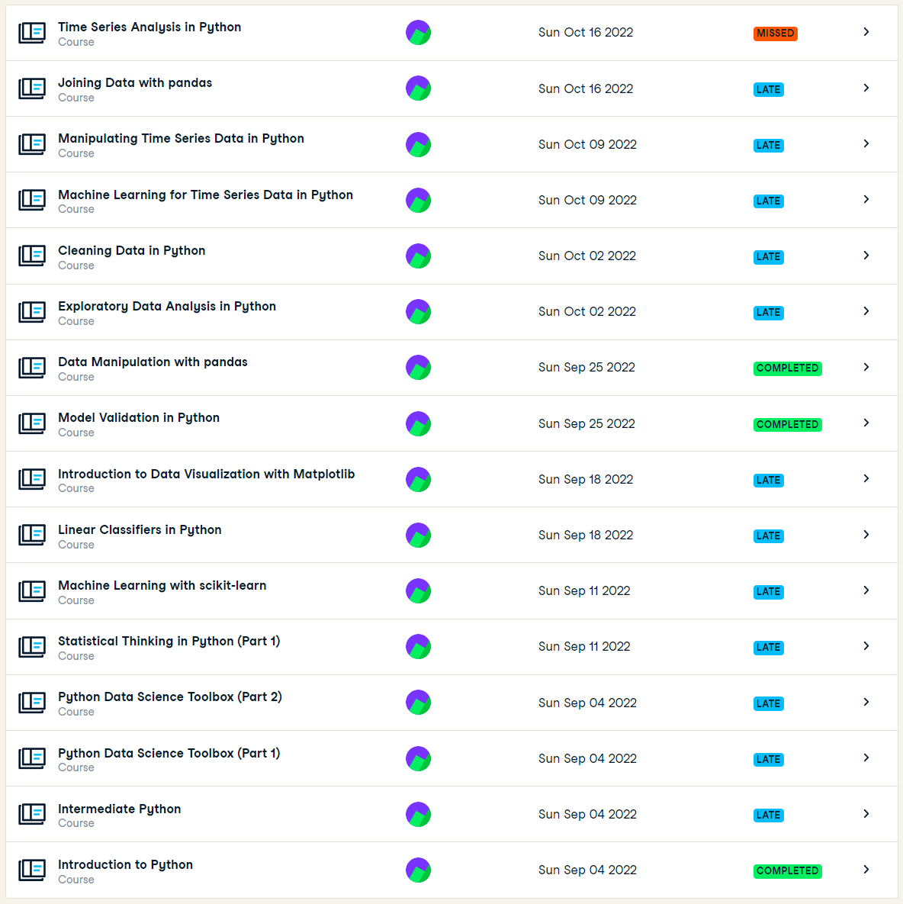

# David's Portfolio - Group 2 of ADS
### Student: David Kaldor - 20141211

# Table of Contents <!-- omit in toc -->
- [Obligatory Criteria](#obligatory-criteria)
  - [Datacamp assignments](#datacamp-assignments)
- [1. The Project](#the-project)
  - [Foodboost](#the-project-foodboost)
  - [Vision](#the-project-vision)
- [2. Predictive Models](#predictive-models)
  - [Foodboost (Decision Tree Classifier)](#predictive-models-foodboost)
  - [Vision (YOLOv5)](#predictive-models-containers)
- [3. Domain Knowledge](#domain-knowledge)
  - [Literature](#domain-knowledge-literature)
  - [Terminology](#domain-knowledge-terminology)
- [4. Data Preprocessing](#data-preprocessing)
  - [Foodboost](#data-preprocessing-foodboost)
  - [Vision](#data-preprocessing-vision)
- [5. Communication](#communication)
  - [Presentations](#presentations)
  - [Paper](#paper)

---

# Obligatory Criteria
## Datacamp assignments

- 21 / 01 / 2023 Datacamp progress

  
  
  [Back to Table of Contents](#table-of-contents)

# 1. The Project
There were two projects we worked on. The first project is Foodboost, and the second project is Vision (IV-Infra). I will cover both of them seperately here.

##  Foodboost
The goal of Project Foodboost was to develop a recommendation system that helps users adopt healthier eating habits. Since the concept of "healthy" can be subjective, our approach was to gradually introduce more nutritious options over an extended period of time, recognizing that eating well is a long-term lifestyle change, not a temporary trend.

For this goal, we set the following research questions:
1. How can we predict a healthier diet for someone based on their previous recipes?
2. How can we define "healthier"?
3. How can we collect recipes that meet the calorie requirements of a single person for a day?

### Future Work
The main setback I felt we had was the lack of real user data, more specifically, user input data. User input data is considered data we can use where a user has rated a considerable amount of tried recipes. Lacking user data is important for a machine learning model that aims to recommend healthier food options because the model relies on this data to learn about the user's preferences, dietary restrictions, and current eating habits. Without this information, the model would not be able to make personalized or accurate recommendations. Additionally, the model would not be able to track the user's progress and adjust its recommendations accordingly. Without data, the model would not be able to learn from user interactions and feedback, which is crucial for improving the model's performance over time.

### Conclusions

#### 1. How can we predict a healthier diet for someone based on their previous recipes?

One way to predict a healthier diet for someone based on their previous recipes is to analyze the nutrient content of the recipes and make recommendations for substitutions or additions of healthier ingredients. For example, if a person frequently uses high-calorie, high-fat ingredients, suggestions could be made to use leaner protein sources and more vegetables. Additionally, a dietary analysis could be done to identify any nutrient deficiencies and make recommendations to address those deficiencies through food choices. Machine learning algorithms can also be used to analyze the person's previous recipes and suggest new, healthier recipes based on their dietary patterns.

#### 2. How can we define "healthier"?

The Nutri-Score is a nutrition label that can be used to define "healthier" food options. The Nutri-Score uses a five-color scale (from dark green to red) to classify foods based on their nutritional quality. The score takes into account the amount of energy (calories), sugar, saturated fat, sodium, and the presence of fruits, vegetables, nuts, fiber, and protein. Foods with a higher Nutri-Score are considered healthier than those with a lower score. Food items are scored based on these criteria and assigned a letter grade (A, B, C, D, or E) with A being the healthiest and E being the least healthy. This scoring system is a simple and effective way to help consumers make informed choices about the nutritional quality of the food they buy.

